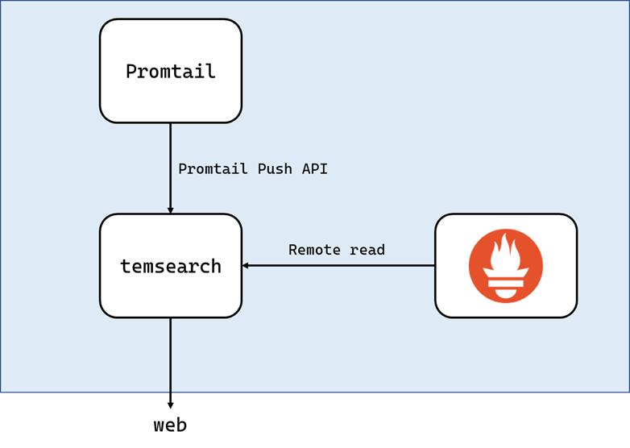
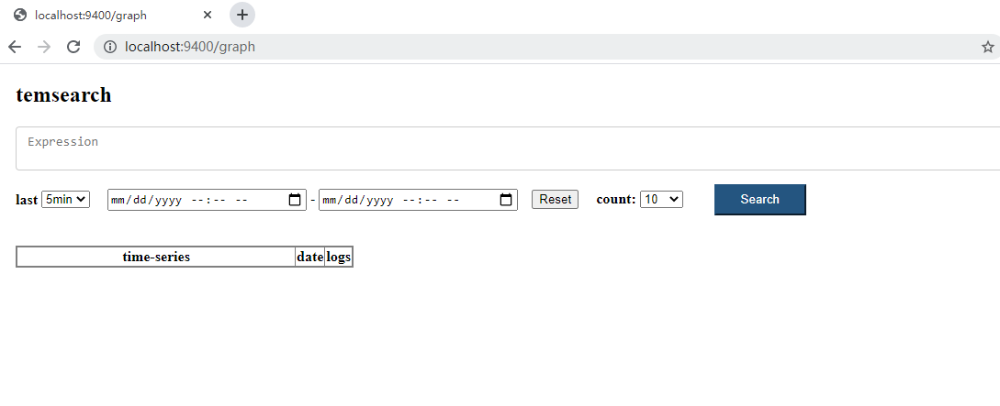

# temsearch
A log time series search engine for kubernetes

temsearch is a lightweight for pod and kube-event log retrieval in the kubernets environment, and stores index and log information in a time series format. currently under development, not available for production
### Features:
- Support promtail to collect logs
- Support full-text indexing and tag-based indexing
- Support log retention policy
- Especially suitable for storing Kubernetes Pod logs
- Able to connect to Prometheus and log alarms



Quick-Start
--------------
1. download `temsearch`
```bash
git clone https://github.com/szuwgh/temsearch.git
```
2. build `temsearch`
```bash
make
```
3. Run server.
```bash
./temsearch start
```

open in browser http://localhost:9400/graph

search with similar promQL syntax, and support log keyword search

  


